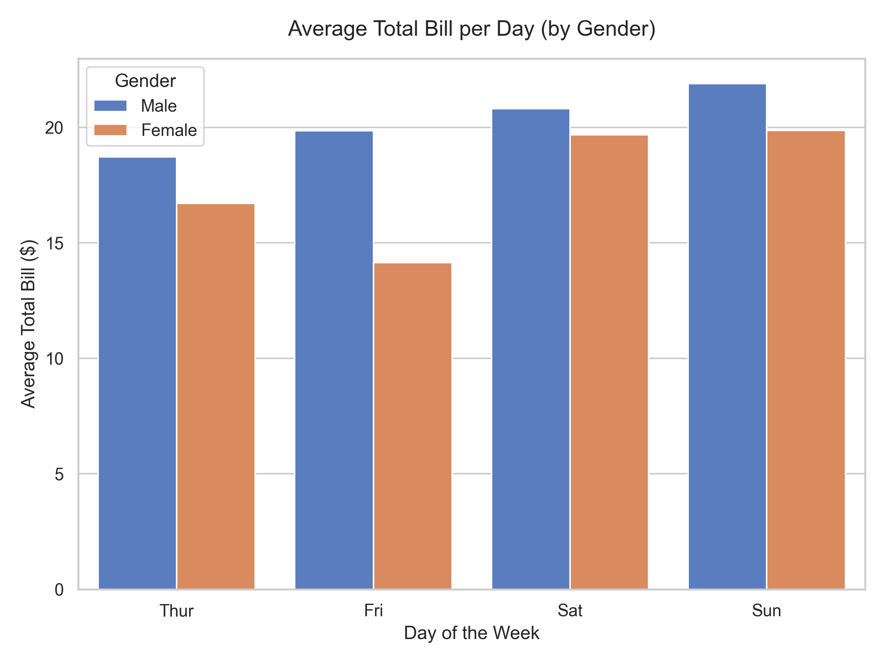
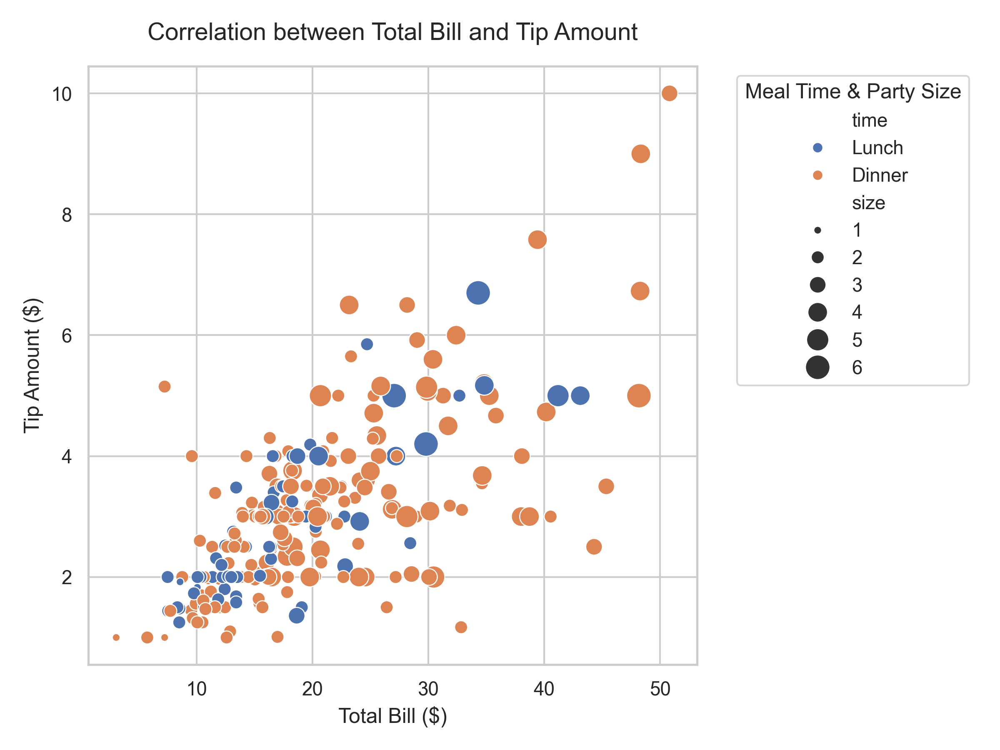
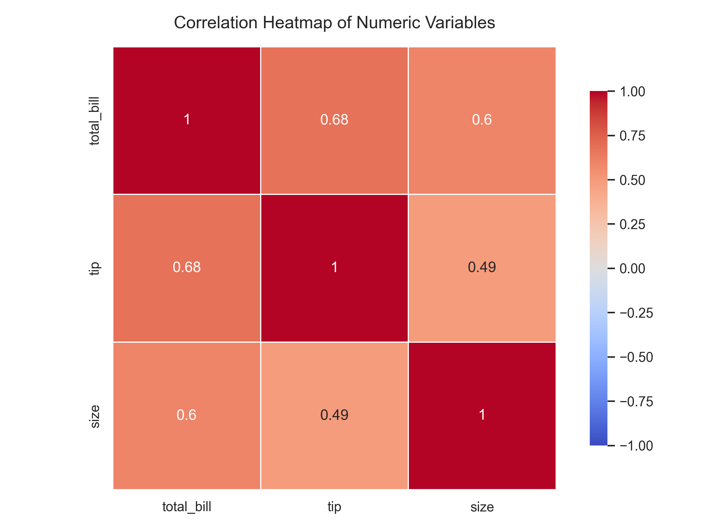

# Data Visualization and Analytics Project

## Overview
This repository contains a comprehensive assignment focusing on the multifaceted layers of visual analytics, spanning from fundamental design abstractions to data visualizations equivalent to JMP, and touching upon emerging analytical methodologies like Digital Twins and Augmented Reality. 

A **Customer Behavior and Restaurant Tipping Dataset** ("tips") was analyzed to uncover correlation trends and insights into diner spending habits. 

## Key Analytical Goals
- **Goal #1 (Comparison & Distribution):** Compare the average total bills spent based on the day of the week, segmented by Gender demographics.
- **Goal #2 (Correlation Trends):** Analyze the linear relationship between the total bill amount and the tip given, observing if party size influences density.
- **Goal #3 (Density & Matrix Interrelation):** Identify global numerical dependencies through correlation heatmap indices.

## Visualizations
The repository includes visual representations depicting key data trends:

### Categorical Comparisons
**Bar Chart:** Displays average total bills ($) mapped categorically against days and genders.

### Trend Identifications
**Scatter Plot:** Demonstrates the multi-variate continuous scale mappings (total bill vs. tip), utilizing marker sizes to represent party demographics.

### Correlation Density
**Heatmap:** Highlights data indices and dependency via diverging color ramps mapping exactly to standard numerical coefficients.

## Data Files
- `dataset.csv`: The core tips dataset utilized for the analytical mapping.
- `Report.md`: Full theoretical abstraction, workflow pipeline details, and analytical summaries answering the assignment requirements.
- `JMP_Assignment_Submission.zip`: The packaged assignment contents.

## Project Insights
Analysis mapping total meal costs to tips predictably scaled with party sizes. High correlation events mapping to weekend sales emphasize that dynamic staffing should peak appropriately during weekend rush-hours. The results effectively apply visual abstractions into comprehensive business utility pipelines.
