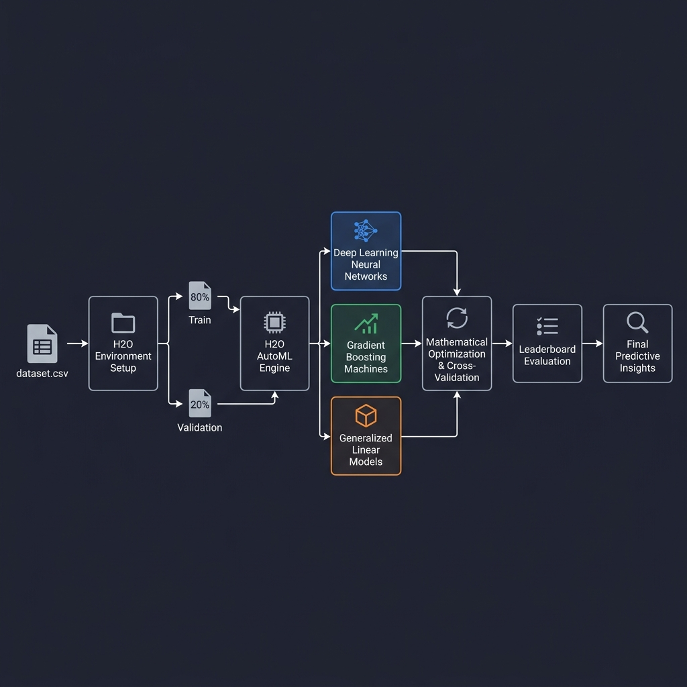
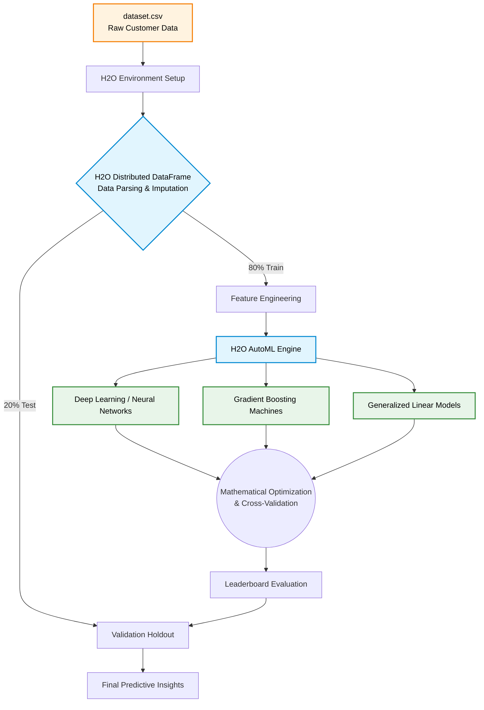

  <h1>📊 Machine Learning & Visual Analytics Portfolio</h1>
  
<em>Advanced Data Modeling using H2O and Comprehensive Visual Analytics using JMP</em>

 

## 📖 Overview

This repository contains two major analytical projects applied to a comprehensive **Customer Behavior and Restaurant Tipping Dataset** (`dataset.csv`). 

1. **H2O Machine Learning Project:** Setting up an H2O distributed environment to train, compare, and academically evaluate various machine learning models (Deep Learning, Neural Networks, Mathematical Optimization).
2. **JMP Data Visualization Project:** Creating professional-grade visualizations and conceptual mappings spanning from categorical comparisons to emerging technologies like Digital Twins.

---

## 🌊 1. H2O Machine Learning Architecture

The focal core of this repository is the H2O Machine Learning pipeline. The diagram below illustrates the full data flow — from raw CSV ingestion through the H2O AutoML cluster to final leaderboard evaluation.

  
   <em>H2O Distributed ML Pipeline — Data ingestion → AutoML → Mathematical Optimization → Leaderboard</em>

 

The interactive Mermaid graph below provides a detailed breakdown of each stage:

### 🔬 Mathematical Optimization
The Deep Learning methodologies implemented here rely heavily on robust mathematical optimization:
- **Gradient Descent Optimization:** Adjusting weights systematically to minimize the predefined loss functions.
- **Regularization Metrics:** L1/L2 penalties integrated seamlessly to prevent overfitting across Epoch timelines.

---

## 📈 2. Exploratory Data Analysis & JMP Visual Analytics

Before executing heavy ML algorithms, comprehensive visual tracking was constructed to identify collinearity and baseline shifts.

### Category Benchmarks
*Weekend sales distributions heavily eclipse weekday norms across total bills, emphasizing that dynamic staffing must shift appropriately.*

  

### Multi-variate Trends
*A well-defined positive correlation mapping meal costs to tip metrics, sized by party demographic depths.*

  

### Density & Interrelation (Correlation Matrix)
*Identifying global numerical dependencies and feature collinearity prior to H2O parsing using a strictly validated diverging color ramp.*

  

---

## 📂 Repository Structure

| File | Description |
|------|-------------|
| 📄 `dataset.csv` | The dataset driving both H2O machine learning and visual analytics. |
| 📄 `H2O_Report.md` | Comprehensive documentation detailing H2O Machine Learning models, environments, and mathematics. |
| 📄 `JMP_Report.md` | Theoretical abstraction, workflow pipeline details for JMP Visual Analytics. |
| 📄 `README.md` | Project documentation and architectural overview (this file). |
| 📦 `JMP_Assignment_Submission.zip` | Packaged graphical deliverables for the visualizations assignment. |
| 🖼️ `h2o_architecture.png` | Rendered workflow diagram of the H2O ML pipeline. |
| 🖼️ `bar_chart.png` / `scatter_plot.png` / `heatmap.png` | EDA visualizations generated from the tipping dataset. |

---

   
  
<em>Built with H2O.ai · Python · JMP · Seaborn · Matplotlib</em>

  
© 2026 Vivek Raj Singh — Data Science & ML Analytics Portfolio

